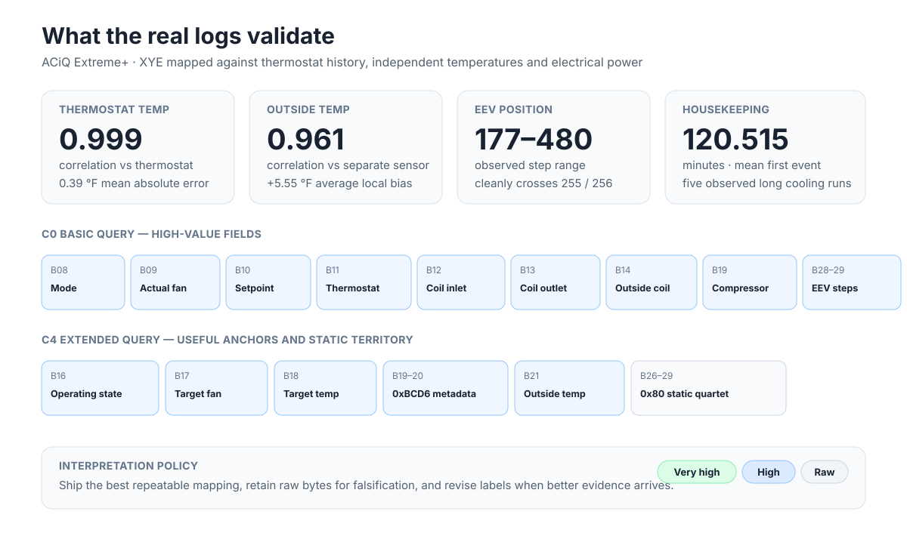
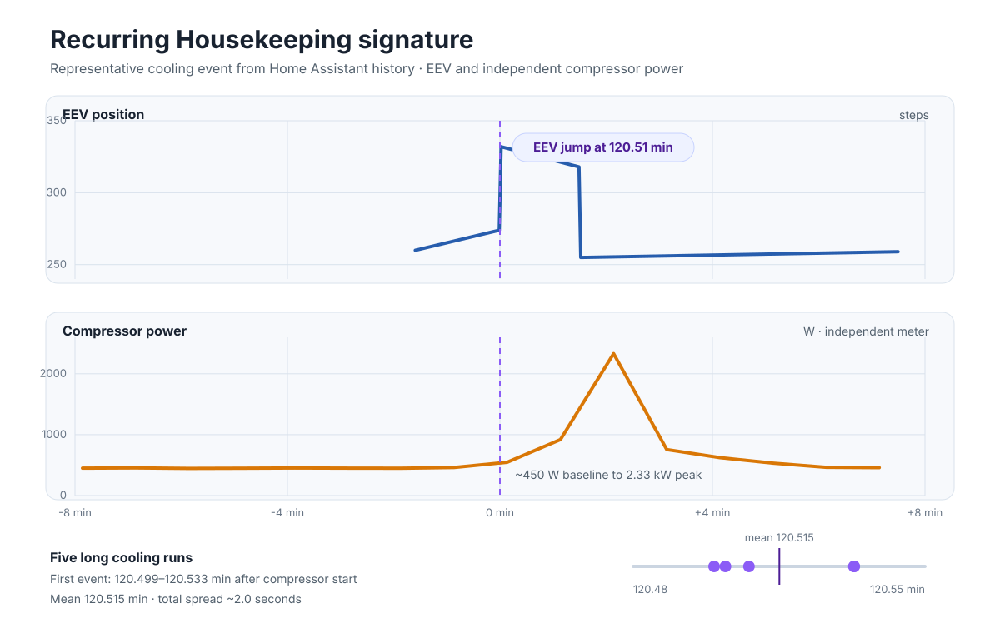

# ACiQ Extreme+ XYE Field Map

This document records an enthusiast-grade map for the ACiQ Extreme+ ducted
heat-pump family, built from live XYE captures, Home Assistant history,
controlled mode/fan tests, independent electrical measurements, and
Midea-family service/protocol material.

Tested hardware:

- ACIQ-48-PAH air handler
- ACIQ-48-HPD outdoor unit
- XYE / RS-485, 4800 baud, 8N1

The goal is practical usefulness. Circumstantial evidence counts when it is
repeatable, physically plausible, and agrees with the rest of the system. Raw
bytes remain available through the optional diagnostics packages so a mapping
can be revised later without losing the underlying evidence.

The graph above intentionally shows the decoded sensors together across many
compressor cycles rather than reducing the validation work to confidence cards.
The displayed traces use a 10-minute cadence for readability; the reported
statistics use the full aligned one-minute history.

## Confidence legend

- **Very high**: repeated direct correlation with commanded state, independent measurement, and/or physically expected refrigeration behavior with no credible competing interpretation.
- **High**: repeatable behavior plus strong protocol/refrigeration evidence, but some semantic detail remains unresolved.
- **Medium**: useful working interpretation, but not independently pinned down.
- **Unknown**: preserve raw value only.

## Recommended Home Assistant names

The generic `midea_xye` component already exposes most useful sensors. A clean
installation should configure those once in the climate block rather than
duplicating them in an ACiQ package.

| Protocol/service name | Recommended friendly name |
|---|---|
| T1 / internal current temperature | **Thermostat Temp** |
| T2A | **Inside Coil Inlet Temp** |
| T2B | **Inside Coil Outlet Temp** |
| T3 | **Outside Coil Temp** |
| T4 / outdoor temperature | **Outside Temp** |
| C0 B19 | **Compressor Running** |
| C0 B28:B29 | **EEV Position** |
| C0 B09 decoded | **Actual Fan Mode** |
| C4 B17 decoded | **Target Fan Mode** |

`examples/aciq-extreme-plus.yaml` intentionally adds only the ACiQ-specific
entities not already supplied by the generic component. See
[`../examples/README.md`](../examples/README.md) for the full recommended
climate configuration.

## Real-log validation

The August 19-20 Home Assistant exports were aligned against the XYE history,
the thermostat, a separate outdoor sensor, and independent compressor/air-handler
power measurements.

Key results:

- **Thermostat Temp:** C0 B11 decoded with `(raw - 40) / 2` °C tracks the
  thermostat current-temperature history with Pearson **r = 0.9989** and about
  **0.39 °F mean absolute error** across 1,310 aligned one-minute samples.
  `r` is a correlation coefficient on a -1..+1 scale, not a percentage.
- **Outside Temp:** C4 B21 decoded with the same temperature formula has
  Pearson **r = 0.9611** against the separate outdoor sensor across 2,635
  aligned samples. The unit-mounted sensor averages about **5.55 °F warmer**,
  consistent with different sensor placement rather than a different quantity.
- **Outside Coil Temp:** C0 B14 follows the outdoor heat-exchanger thermal state
  across compressor cycles and tracks the expected refrigeration response.
- **Inside Coil Inlet / Outlet:** C0 B12/B13 separate under active refrigeration,
  move together through load changes, and converge when the compressor stops.
- **Compressor Running:** C0 B19 tracks the independent compressor power state
  and thermostat HVAC action.
- **EEV Position:** C0 B28:B29 is the bus-reported EEV position. It is a single
  little-endian value, crosses 255/256 cleanly, moves in repeatable stepper-like
  sequences, parks at 480, modulates with refrigeration load, and participates
  directly in the Housekeeping Routine. Observed range is roughly **177..480 steps**.
- **Housekeeping Routine:** nine observed routines show the same EEV-opening +
  compressor-power choreography. Seven first events occur at about **120.5 min**
  of uninterrupted compressor operation; two long runs show a repeat event at
  about **242.0 min**.

## C0 basic query payload

Absolute receive-frame positions are shown below. Payload is bytes 6..29.

| Byte | Current interpretation | Observed ACiQ behavior | Confidence |
|---|---|---|---|
| B06 | Unknown/configuration | Commonly 48 on tested unit | Unknown |
| B07 | Capabilities | Commonly 20 on tested unit | Medium |
| B08 | Operating mode | OFF=0x00, FAN=0x81, DRY=0x82, HEAT=0x84, COOL=0x88, AUTO observed as 0x98 | Very high |
| B09 | Actual fan state | Bit 7=AUTO; low nibble: 0=off, 1=high, 2=medium, 3/4=low | Very high |
| B10 | Target temperature | Raw Celsius setpoint on tested system | Very high |
| B11 | Thermostat / T1 temperature | `(raw - 40) / 2` °C | Very high |
| B12 | Inside coil inlet / T2A | `(raw - 40) / 2` °C | Very high |
| B13 | Inside coil outlet / T2B | `(raw - 40) / 2` °C | Very high |
| B14 | Outside coil / T3 | `(raw - 40) / 2` °C; follows outdoor heat-exchanger refrigeration behavior | **Very high** |
| B15 | Current field / unsupported sentinel | 0xFF on tested ACiQ; do not interpret as 255 A | High |
| B16 | Unknown/reserved | 0 on tested unit | Unknown |
| B17 | Start timer | Usually 0 in captures | Medium |
| B18 | Stop timer | Usually 0 in captures | Medium |
| B19 | Compressor running | 0=idle, 1=running; aligns with independent compressor power | Very high |
| B20 | Mode flags | Usually 0 in current captures | Medium |
| B21 | Operation flags | Usually 0 in current captures | Medium |
| B22-23 | Error flags, little-endian | 0 in normal operation | High |
| B24-25 | Protection flags, little-endian | 0 in normal operation | High |
| B26 | CCM communication/error field | 0 in current captures | Medium |
| B27 | Unknown/configuration | 0 in current captures | Unknown |
| B28-29 | **EEV position, little-endian steps** | Dynamic ~177..480; smooth 16-bit transitions; repeatable stepper motion; parks at 480; correlates with refrigeration operation | **Very high** |

### EEV notes

`EEV = B28 | (B29 << 8)`

Evidence on the tested Extreme+ system:

- Observed operating range is roughly 177..480 steps.
- Crossing the 255/256 boundary is smooth, establishing a single 16-bit value.
- Compressor shutdown repeatedly drives the valve toward 480 in ~62/63-step increments.
- Cooling startup moves from 480 toward its operating position before B19 becomes active.
- Steady operation shows smaller modulation corrections that follow refrigeration load.
- The valve opens abruptly during the recurring Housekeeping Routine while compressor power rises.
- Midea-family service material and commercial gateways expose EXV/EEV position as a normal engineering value on related equipment.

On this bus this field is simply **EEV Position**. The earlier candidate/provisional
wording is retained only in some raw diagnostic entity IDs to avoid destroying
existing Home Assistant history.

## C4 extended query payload

| Byte | Current interpretation | Observed ACiQ behavior | Confidence |
|---|---|---|---|
| B06 | Indoor fan PWM protocol slot | 0 despite large real blower-power changes | Low usefulness |
| B07 | Indoor fan tach protocol slot | 0 despite large real blower-power changes | Low usefulness |
| B08 | Unknown/fixed field | 0x80 across compressor on/off states | Unknown |
| B09 | ESP/profile field | 0x30 on tested unit | Medium |
| B10 | Unknown/fixed/protection-style field | 0x8C across normal state changes | Unknown |
| B11 | Coil inlet protocol slot | 0 on tested unit | Unused here |
| B12 | Coil outlet protocol slot | 0 on tested unit | Unused here |
| B13 | Discharge-temperature protocol slot | 0 on tested unit | Unused here |
| B14 | Expansion-valve protocol slot | 0 on tested unit | Unused here |
| B15 | Reserved | 0 on tested unit | Unknown |
| B16 | Operating mode/state | OFF=0x01, FAN=0x81, DRY=0x82, HEAT=0x84, COOL=0x88, AUTO=0x90; 0x08 briefly observed while disabling COOL | Very high |
| B17 | Target/commanded fan | Same fan-encoding family as C0; holds commanded speed while actual fan can differ | Very high |
| B18 | Target temperature | On tested Fahrenheit-configured unit: `raw - 135 = °F` | Very high |
| B19-20 | Fixed metadata/signature | 0xBCD6 / 48342 in all current ACiQ captures; also seen in related Midea-family traffic | High that it is not live telemetry |
| B21 | Outside / T4 temperature | `(raw - 40) / 2` °C; independently correlated with outdoor temperature | **Very high** |
| B22 | Reserved | 0 | Unknown |
| B23 | Reserved | 0 | Unknown |
| B24 | Static-pressure/profile protocol field | 0 on tested unit; did not reflect large filter-pressure/blower-power changes | Low as measured static pressure |
| B25 | Reserved | 0 | Unknown |
| B26 | Unknown/static field | 0x80 in all captured ACiQ states so far | Unknown |
| B27 | Unknown/static field | 0x80 in all captured ACiQ states so far | Unknown |
| B28 | Unknown/static field | 0x80 in all captured ACiQ states so far | Unknown |
| B29 | Unknown/static field | 0x80 in all captured ACiQ states so far | Unknown |

## Fan behavior

C0 B09 reports the actual running fan state:

- bit 7 (`0x80`) indicates automatic fan control
- low nibble reports physical speed
- 0x01 = HIGH
- 0x02 = MEDIUM
- 0x03 or 0x04 = LOW
- 0x00 = OFF

Examples observed on the ACiQ:

- `0x84` = AUTO + LOW
- `0x82` = AUTO + MEDIUM
- `0x81` = AUTO + HIGH
- bare `0x04`, `0x02`, `0x01` = manual LOW/MEDIUM/HIGH

C4 B17 is the target/commanded fan setting and can remain AUTO while C0 shows
the physical speed selected underneath AUTO.

## Housekeeping Routine (likely oil return)

The operational/user-facing name is **Housekeeping**. In the research notes and
visuals the full event name is **Housekeeping Routine**. The best engineering
interpretation is **oil/lubricant return**.

Nine observed routines are now visible in the aligned XYE + electrical history:

- **7 first routines** cluster at approximately **120.5 minutes** of continuous compressor operation.
- **2 repeat routines** occur at approximately **242.0 minutes** in runs long enough to reach a second event.
- The first-routine timing spread remains only a few seconds despite different outdoor temperatures and compressor loads.

Observed signature:

- cooling continues rather than entering a defrost operating state
- EEV Position opens abruptly by roughly 50-80 steps
- independent compressor electrical power rises markedly immediately afterward
- EEV Position returns toward its prior modulation range
- C0 protection flags remain clear in the observed cooling events
- the HomeOps defrost entity remains off in the observed cooling events

Representative examples include approximately 260→332 steps with compressor
power rising from ~0.45 kW to ~2.33 kW, and 250→328 steps with power rising from
~0.74 kW to ~2.67 kW. The event-aligned visual shows all nine routines as thin
traces and their median choreography as the heavy traces.

Midea literature describes oil-return logic with the same general ingredients:
long low-frequency runtime, compressor-frequency increase, and EEV movement.
For this enthusiast project the observed routine is named **Housekeeping**, with
**likely oil return** documenting the engineering interpretation.

No dedicated Housekeeping flag has yet been identified on C0/C4, so the clean
ESPHome profile does not synthesize a Housekeeping binary entity.

## Filter / blower experiment

A large real-world airflow-resistance change did **not** move C4 B06, B07, or
B24 on the tested air handler:

| Air path | Approx. air-handler power | XYE-reported fan state |
|---|---:|---|
| No filter | ~65 W | AUTO + LOW |
| Disposable MERV 11 | ~80 W | AUTO + LOW |
| Restrictive washable MERV 11 | ~150 W | AUTO + LOW |

This strongly suggests that the indoor ECM performs substantial local
torque/RPM/static compensation that these particular XYE fields do not expose
on this air handler.

## Package layout

For normal use:

- configure the generic `midea_xye` sensors with the friendly names in `examples/README.md`
- add `examples/aciq-extreme-plus.yaml` for EEV and fan/mode comparison entities

For ongoing reverse engineering, optionally add:

- `examples/aciq-diagnostics.yaml` - established/raw C0/C4 fields
- `examples/aciq-byte-watch.yaml` - temporary observer for remaining payload bytes
- `examples/aciq-snapshot.yaml` - one-click capture helper

The raw packages are deliberately separate so normal installations do not have
to carry the laboratory instrumentation forever.
